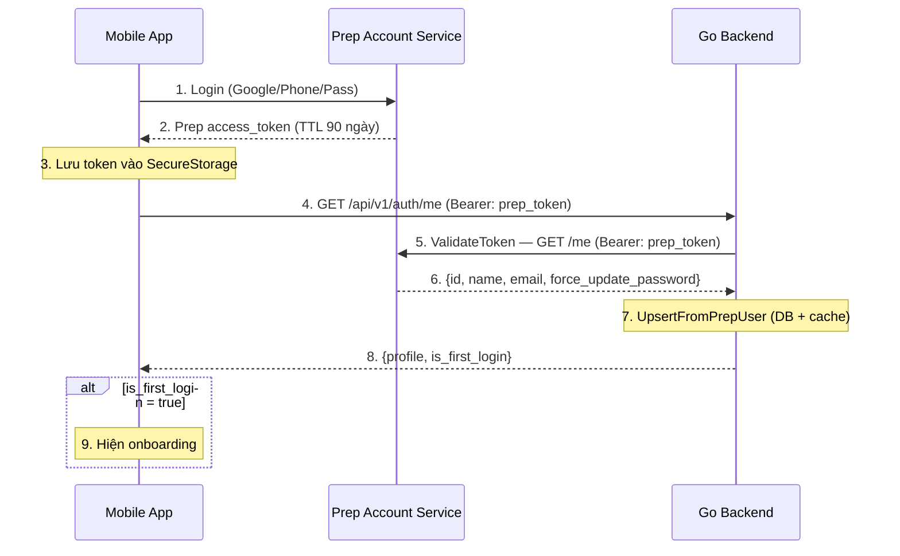
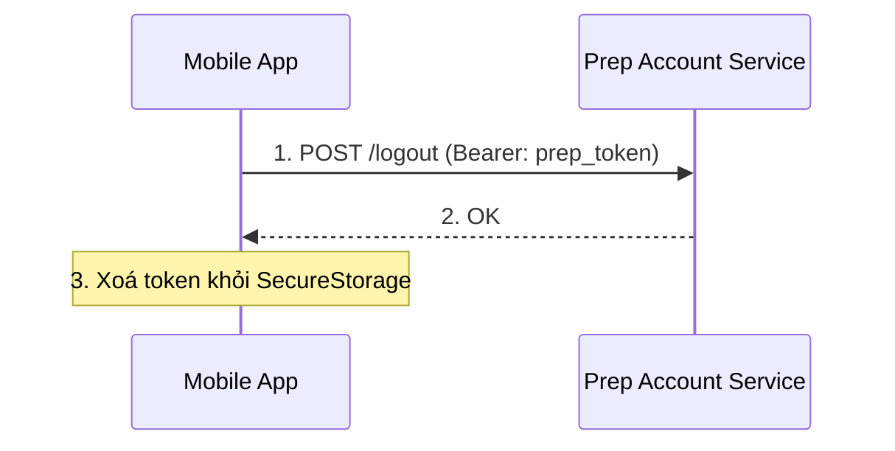
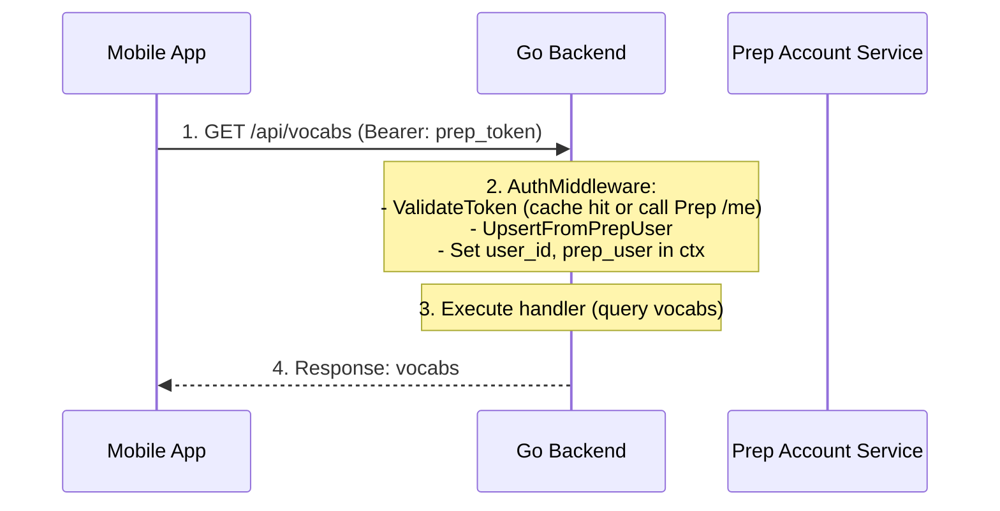
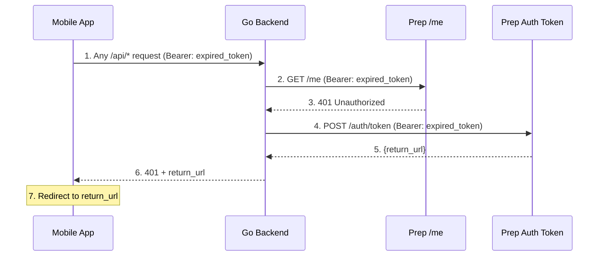

# Auth Module — Authentication Flow

> Tài liệu mô tả các luồng xác thực giữa Mobile App, Go Backend và Prep Account Service.

---

## 1. Tổng quan

Mobile app quản lý **1 token duy nhất**: Prep access_token. Token này dùng cho cả Prep platform lẫn Go backend.

- **Login/Logout**: Mobile gọi trực tiếp Prep platform
- **Mọi request tới Go backend**: Gửi Prep token trong header `Authorization: Bearer <prep_token>`
- **Go backend**: AuthMiddleware gọi Prep `/me` để validate token + lấy user info (có Redis cache). Nếu user mới → upsert vào DB. Gắn `user_id` + `prep_user` vào context cho handler.

---

## 2. Luồng Login



**Các bước:**

1. Mobile login trực tiếp Prep platform (Google/Phone/Password)
2. Prep trả access_token (TTL 90 ngày)
3. Mobile lưu token vào SecureStorage
4. Mobile gọi Go backend `GET /api/v1/auth/me` để lấy profile local
5. AuthMiddleware gọi `PrepUserService.ValidateToken()` → Prep `/me` (có circuit breaker + Redis cache)
6. Prep xác nhận OK → trả user data (id, name, email, force_update_password)
7. AuthMiddleware gọi `AuthUseCase.UpsertFromPrepUser()` → upsert user vào DB, gắn `user_id` + `prep_user` vào context
8. Handler `GetMe` trả profile local + `is_first_login` cho mobile
9. Nếu first login → mobile hiện onboarding

---

## 3. Luồng Logout



Go backend **không liên quan**. Không cần gọi Go khi logout. Token cache trên Redis sẽ tự hết hạn.

---

## 4. Luồng Request (protected)



### Khi token hết hạn hoặc bị revoke:



**Response 401 (có return_url):**

```json
{
  "success": false,
  "message": "Unauthorized",
  "data": {
    "return_url": "https://prep.vn/login?redirect=..."
  }
}
```

> Nếu Prep Auth Token API không trả được `return_url` (down, timeout...), response 401 sẽ không có `data` → mobile tự redirect về màn login mặc định.
>
> Cả hai endpoint Prep (`/auth/api/v1.1/auth/me` và `/api/v1.1/auth/token`) đều dùng chung `PREP_API_DOMAIN`.

---

## 5. Authentication cho tất cả Go API

Mọi request tới `/api/*` đều đi qua `AuthMiddleware`, thực hiện:

1. Parse `Authorization: Bearer <prep_token>` header
2. Gọi `PrepUserService.ValidateToken()` — check Redis cache → miss thì gọi Prep `{PREP_API_DOMAIN}/auth/api/v1.1/auth/me` (qua circuit breaker)
3. Gọi `AuthUseCase.UpsertFromPrepUser()` — upsert user vào Postgres
4. Gắn `user_id` (UUID string) + `prep_user` (*domain.PrepUser) vào Gin context

### Error responses chung:

| Status | Khi nào | Mobile xử lý |
|---|---|---|
| `401` | Token missing / hết hạn / bị revoke / sai | Redirect về màn login Prep |
| `503` | Prep API down (circuit breaker trip) | Hiện thông báo "Thử lại sau" |
