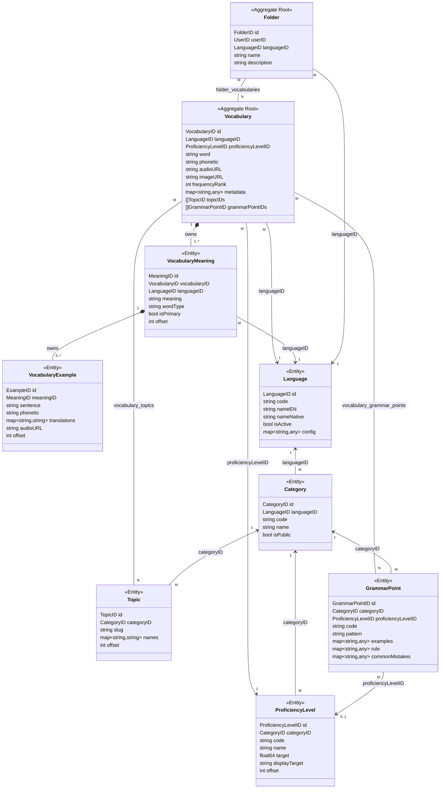
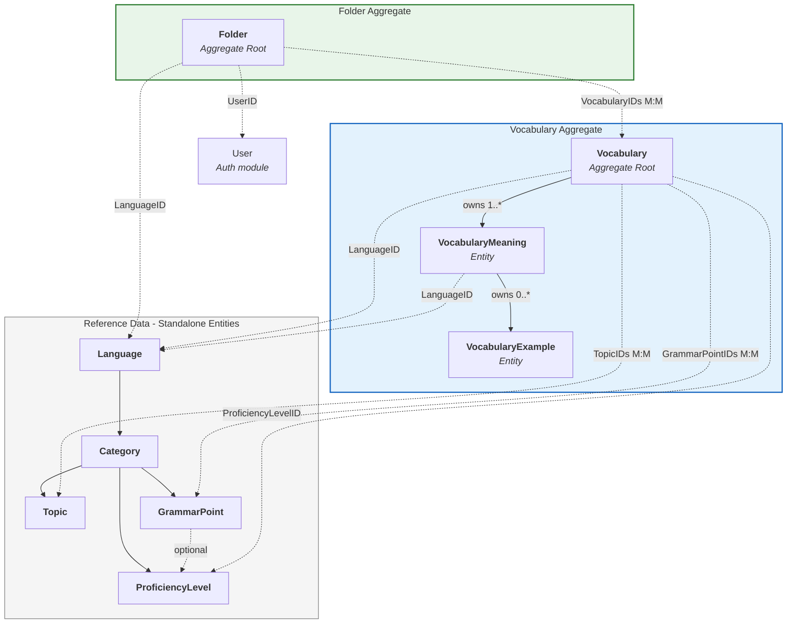
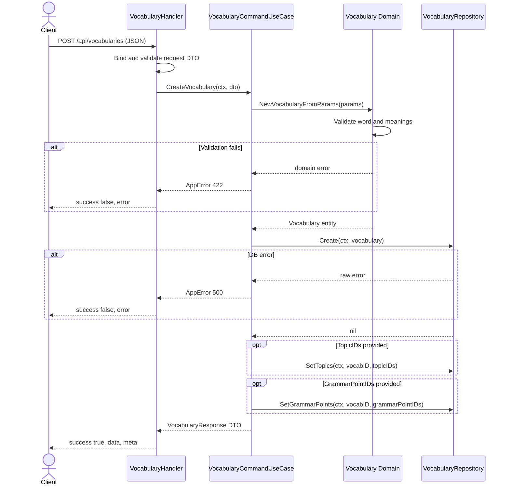
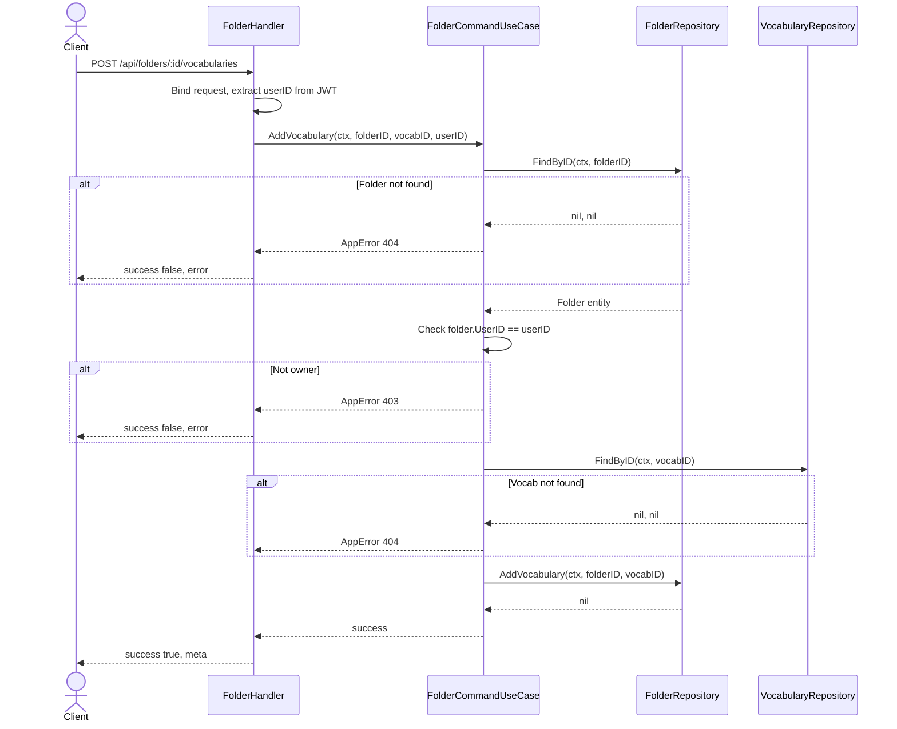

# Vocabulary Module — Domain Model

## Entity Relationship Review

### Aggregate Roots

| Aggregate | Root Entity | Owned Entities |
|-----------|-------------|----------------|
| Vocabulary | `Vocabulary` | `VocabularyMeaning`, `VocabularyExample` |
| Folder | `Folder` | *(none — references Vocabulary by ID)* |

### Reference Data (Standalone Entities)

`Language` → `Category` → `ProficiencyLevel` / `Topic` / `GrammarPoint`

These are lookup/taxonomy entities, not aggregate roots. Each has its own repository.

### Cross-Aggregate References (by ID only)

| From | To | Via |
|------|----|-----|
| Vocabulary | Language | `languageID` FK |
| Vocabulary | ProficiencyLevel | `proficiencyLevelID` FK |
| Vocabulary | Topic | `vocabulary_topics` junction (M:M) |
| Vocabulary | GrammarPoint | `vocabulary_grammar_points` junction (M:M) |
| VocabularyMeaning | Language | `languageID` FK (target language) |
| Folder | User (auth module) | `userID` FK |
| Folder | Language | `languageID` FK |
| Folder | Vocabulary | `folder_vocabularies` junction (M:M) |
| GrammarPoint | ProficiencyLevel | `proficiencyLevelID` FK (optional) |

### Design Notes

1. **Potential inconsistency**: `Vocabulary` references both `LanguageID` and `ProficiencyLevelID` directly, but `ProficiencyLevel` belongs to `Category` which belongs to `Language`. No domain-level validation ensures the `ProficiencyLevelID` belongs to the correct language chain. Consider validating at the use case layer.

2. **Same concern for M:M**: `Vocabulary ↔ Topic` and `Vocabulary ↔ GrammarPoint` — Topic/GrammarPoint belong to a Category scoped to a Language, but there is no constraint ensuring they match the Vocabulary's language.

3. **Folder is user-scoped, Vocabulary is system-wide**: Correct design — vocabularies are shared content, folders are personal collections.

---

## 1. Domain Model Diagram

---

## 2. Aggregate Diagram

> Dashed lines = reference by ID (cross-aggregate). Solid lines = ownership within aggregate.

---

## 3. Sequence Diagram — CreateVocabulary

---

## 4. Sequence Diagram — Folder AddVocabulary

